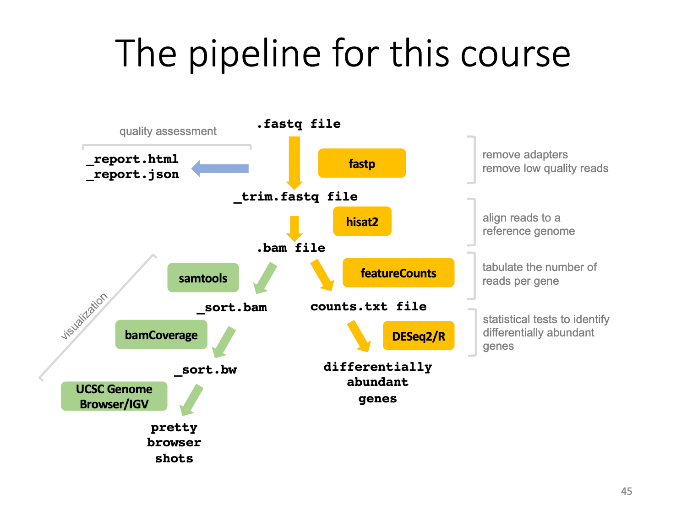
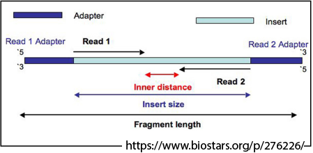
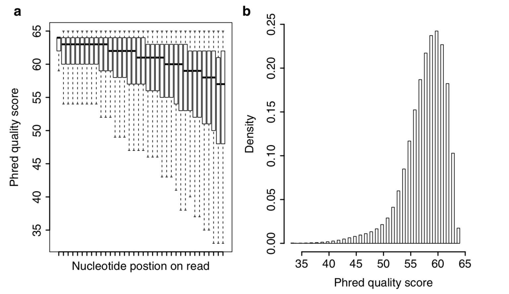
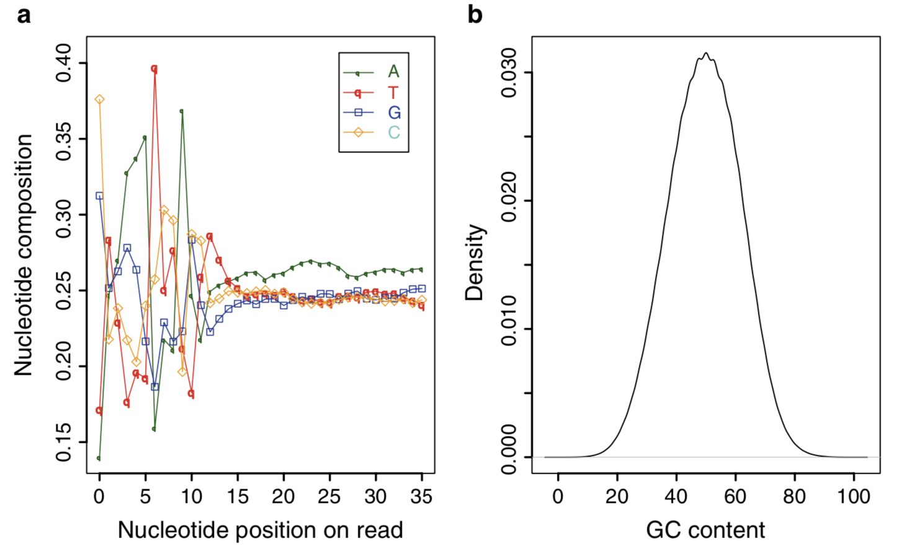
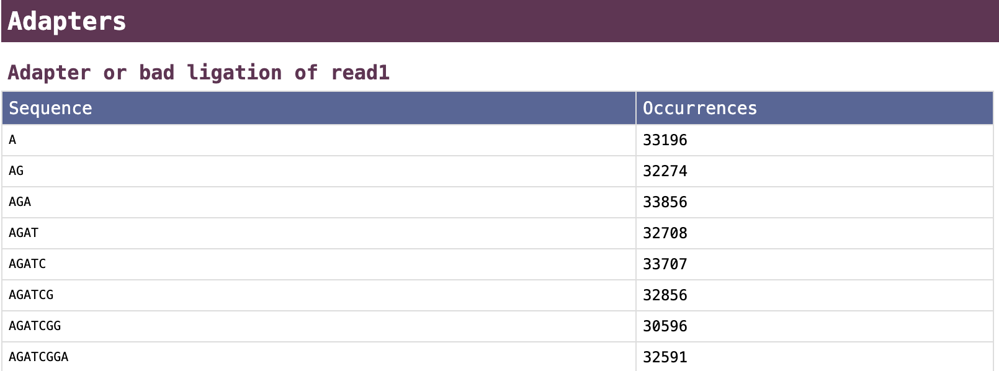
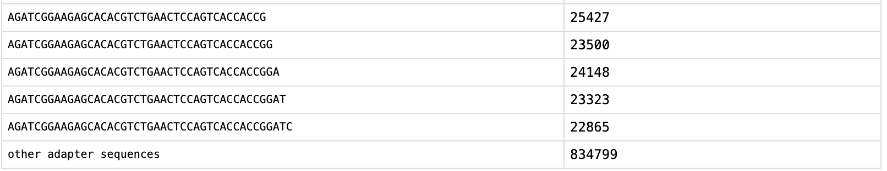
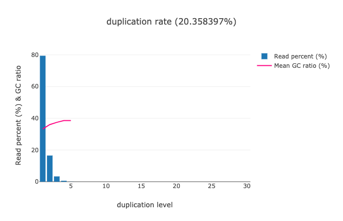
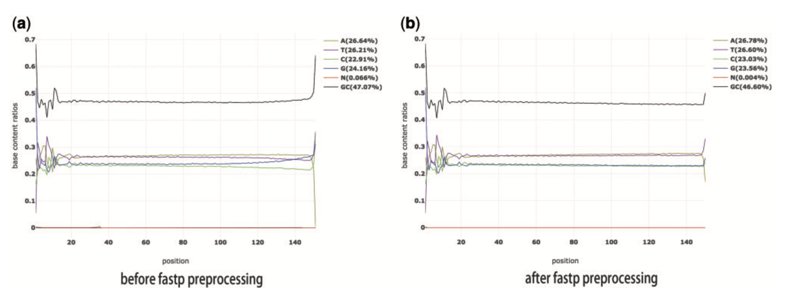

<br/>

## Raw read structure

A paired-end read is a PCR-amplified fragment enclosed inside adapters. The whole fragment is sequenced.

<br/>

## Raw Sequence Quality

__Phred quality score__ (Q) was originally developed by the program Phred to measure base-calling reliability from Sanger sequencing chromatograms.

$Q = -10 * log_{10}(P)$ where P is the probability of erroneous base calling.

__For example:__
* Q20: $-10 * log_{10}(1/100) = 20$
* Q30: $-10 * log_{10}(1/1000) = 30$
* Q40: $-10 * log_{10}(1/10^4) = 40$
* Q50: $-10 * log_{10}(10^{-5}) = 50$
* Q60: $-10 * log_{10}(10^{-6}) = 60$

__Quality scoring range:__

 * $< 20$: poor quality
 * $20 - 30$: moderate quality
 * $> 30$: high quality
 
__Example fastq read__

``
@SRR5832182.1 HISEQ-MFG:180:hw5f3bcxx:2:1101:1205:2195 length=101
CGCGAACAGTCCTCAAATCGGGGATCGAAAAAGGATTCGTGGAATCACAGTATTTTTATGTATAATTTCTTCCACCGAAGAGGGAGCAACAAGAGAGCGGC
+SRR5832182.1 HISEQ-MFG:180:hw5f3bcxx:2:1101:1205:2195 length=101
DDDDDHHIIIIIIIIIIIIIIIIIIIIIIIIIIIIIIIIGHHHIEHIIIIIIIIIIFHIIIHIIIIIHIIIIIIIIIIIIIIIIGHHIIIIIHIIHIIIIH
``

Each read (in fastq format) has four lines:
 1. ID
 2. Base call (the sequence)
 3. ID again for some reason (or just a plus sign)
 4. Quality symbol for each base call
 
## Quality symbols for Q: 32-40 

| symbol | ascii value | Q | 
|--------|-------------|---|
| A | 65 | 32 |
| B | 66 | 33 |
| C | 67 | 34 |
| D | 68 | 35 |
| E | 69 | 36 |
| F | 70 | 37 |
| G | 71 | 38 |
| H | 72 | 39 |
| I | 73 | 40 |
 
Link for full(er) table: https://support.illumina.com/help/BaseSpace_OLH_009008/Content/Source/Informatics/BS/QualityScoreEncoding_swBS.htm

Is $ascii -33$, going all the way to 126 (symbol='~', Q=93). See http://www.asciitable.com/ if you're interested in how this works.

## Quality scores for a sequencing run

<br/>
__Li et al. Fig 1. a)__ Parallel boxplot showing “per nucleotide quality score.” All reads are overlaid together, and then summarize Phred quality score (Y-axis) for each position of read from 5′ to 3′ end (X-axis). __(b)__ “per sequence quality score” distribution. For each read, “per sequence quality score” is calculated as the average Phred quality score (X-axis) across all nucleotides


## Nucleotide Composition and GC Content

<br/>

__Li et al. Fig 2. (a)__ Diagram showing nucleotide composition bias at the beginning of reads. All reads are overlaid together, and then calculate nucleotide frequency (Y-axis) for each position of read (X-axis). Four nucleotides were indicated using different colors. __(b)__ “per sequence GC content” distribution. This normal distribution should be centered at the GC content of your coding genome (exons only). A shift represents a bias or contamination.

# fastp 

__Reference__: https://watermark.silverchair.com/bty560.pdf fastp: an ultra-fast all-in-one FASTQ preprocessor __Bioinformatics,__ 34, 2018, i884–i890

__Today's reading__: http://rna.colostate.edu/2019/lib/exe/fetch.php?media=assignments:li_etal_qualitycontrol_2015.pdf

## Benefits of fastp over other tools

* Trimming and Quality in one
* Faster implementation
* Automatically finds adapters
* Interactive HTML output

# fastp reports

## Adapter identification


<br/>

...

<br/>

___Courtesy of Rob Williams___

## PCR duplication

<br/>

___Courtesy of Rob Williams___


## Base content filtering

<br/>

___fastp paper figure 3___

***

# Let's process some data

## Where are we right now?
 * We're already on summit
 * We're already running a job (a 12 hour interactive job that we _spawned_).
 * That means we're on a compute node, and it's OK to run a full job (we're usually on a login or compile node).
 * Counts against fairshare. So we need to stop the server when we're done. (See the bottom of the notebook and/or the wiki page).
 * We're in the jupyterhub web-based interface instead of the basic terminal interface.
     * File menu, Edit menu, etc. not part of your OS, but inside your web browser.
     * Open tabs are on the right - these are notebooks, consoles, and other (including terminals).
     * Icons below files menu:
         * Plus sign - Launcher
         * Dark Folder with light plus sign - new Folder
         * Up-arrow with underline - upload file
         * Circular arrow - refresh file list
     * next row of icons: current location: `[folder icon]/.../parent directory/current directory`
     * file browser - __Name__ __Last Modified__
         

## Workflow

1. Create a working directory for this exercise.
2. Link to data (I already downloaded it - very large).
3. Set up _fastp_ through a container and make an alias.
4. Run the program on a single dataset. Inspect.
6. Write a script to run the other datasets in a batch job (we'll do this from the terminal)

First, let's set aside some space in the working directory. 


```bash
# Step 1: create a workspace
cd /scratch/summit/$USER
mkdir DSCI512_RNAseq_19_19_11
cd DSCI512_RNAseq_19_19_11
```


```bash
pwd
```

In the upper lefthand corner, go to File -> `Open from path...` and paste in the output from the previous command.  

This will open the file browser to the current location.
***
Now we're going to link a data directory to this current directory. We do this because the data is very large and will take too long for a demonstration. 
The link will reside in the present directory and act like any other, except you won't be able to change its contents. It is __read-only.__


```bash
# make directories to use through processing
# skipping 01_input - we will make that with a link below
mkdir 02_output
mkdir 03_scripts
mkdir 04_logs
```


```bash
#link to the data directory (I have already downloaded everything)
ln -sv /scratch/summit/dcking@colostate.edu/DSCI512/2019/data 01_input
```


```bash
# Look at your directory structure.
ls -lh
```


&#128270; Navigate around the file browser on the left
 * doubleclick a link to descend
 * go to a parent directory by clicking the name after the 3 dots in the location field: `folder_icon/.../parent_directory/current_directory`

#### Breakdown of data in 01_input/

***
__Experimental design__

|IDs (3 reps each)    | Temperature | Food Source |
|---------------------|-------------|-------------|
|SRR58321<b>82</b>-SRR58321<b>84</b>| 15°C        |  _E. coli_  |
|SRR58321<b>85</b>-SRR58321<b>87</b>| 20°C        |  _E. coli_  |
|SRR58321<b>88</b>-SRR58321<b>90</b>| 25°C        |  _E. coli_  |
|SRR58321<b>91</b>-SRR58321<b>93</b>| 15°C        |  _B. subtilis_  |
|SRR58321<b>94</b>-SRR58321<b>96</b>| 20°C        |  _B. subtilis_  |
|SRR58321<b>97</b>-SRR58321<b>99</b>| 25°C        |  _B. subtilis_  |

***

* 6 conditions
* 3 reps each
* Each replicate is paired-end. Thus, _SRR5832182_ is represented by: 
  * SRR58321<b>82<i>_1</i></b>.fastq - "left" end reads.
  * SRR58321<b>82<i>_2</i></b>.fastq - "right" end reads.
* 36 total files

# Running fastp

We will run this through a singularity container:

 * Load the singularity module
 * Test the container with the full command (long)
 * Make an alias for the long command


```bash
# Step 3: load the module that works with containers
module load singularity
module list
```

The following command:
`singularity exec /projects/dcking@colostate.edu/containers/Summit_RNAseq_container.sif fastp`
 * __singularity__ - A program that reads a container.
 * __exec__ - verb: execute
 * ___[path to container image]___: The container itself, called an image.
 * __fastp__: The program you want to execute.


```bash
# Step 4: Run fastp through the container without arguments- gives catalog of available flags
singularity exec /projects/dcking@colostate.edu/containers/Summit_RNAseq_container.sif fastp
```

___This is OK --->___ <font color=orange>WARNING: Non existent 'bind path' source: '/rc_scratch'</font> <--- ___It's just part of the configuration.___


```bash
# Make a shortcut for fastp
fastp='singularity exec /projects/dcking@colostate.edu/containers/Summit_RNAseq_container.sif fastp'
```

You will now be able to type _fastp_ in place of the long command.


```bash
# Test the alias- same output.
$fastp
```


```bash
wc -l 01_input/SRR5832182_1.fastq 01_input/SRR5832182_2.fastq
```

## fastp command usage

__The usage message tells us for _paired end_ data:__

`-i readfile_1.fastq -I readfile_2.fastq`

`-o outputfile_1.fastq -O outputfile_2.fastq`

`[options]`

For the options:

 * __-x__: remove polyX (polyAs polyCs polyGs polyTs)
 * __-p__: overrepresentation analysis
 * __--thread__: We only have 1 on jupyterhub. We can use more in our script.
 * __-h,-j__: The report filenames in html, json (javascript object notation).

To explicitly specify adapter sequences, see this part of the usage message:

```
-a, --adapter_sequence               the adapter for read1. For SE data, if not specified, the adapter will be auto-detected. For PE data, this is used if R1/R2 are found not overlapped. (string [=auto])
      --adapter_sequence_r2            the adapter for read2 (PE data only). This is used if R1/R2 are found not overlapped. If not specified, it will be the same as <adapter_sequence> (string [=auto])
      --adapter_fasta                  specify a FASTA file to trim both read1 and read2 (if PE) by all the sequences in this FASTA file (string [=])
      --detect_adapter_for_pe          by default, the auto-detection for adapter is for SE data input only, turn on this option to enable it for PE data.
```

***
### Command version 1:


```bash
$fastp -i 01_input/SRR5832199_1.fastq       -I 01_input/SRR5832199_2.fastq \
           -o 02_output/SRR5832199_trim_1.fastq -O 02_output/SRR5832199_trim_2.fastq \
           -h 02_output/SRR5832199_report.html  -j 02_output/SRR5832199_report.json\
           --thread 1 \
           -g -x -p 

```

___This is OK --->___ <font color=orange>WARNING: Non existent 'bind path' source: '/rc_scratch'</font> <--- ___It's just part of the configuration.___

&#9203; __Still waiting?__ It is running while you still see <font color="blue">`[*]`</font> with the asterisk. Give it about a minute.

### Notice the terminal output
 * Basic statistics - covered in depth by the html output
 * Amount of time it ran - this will help us scale up in the batch script.

### Check the output ### 
Navigate to __02_output__ in the file browser and double-click _SRR5832199_report.html_

### Run a different file
Now if we want to process a different expirement, we have to ___change our arguments in 6 places!!!___

Let's use a variable to make it easier to re-run the program on new data.

## Command version 2:


```bash
SRRID=SRR5832198
$fastp -i 01_input/${SRRID}_1.fastq       -I 01_input/${SRRID}_2.fastq \
           -o 02_output/${SRRID}_trim_1.fastq -O 02_output/${SRRID}_trim_2.fastq \
           -h 02_output/${SRRID}_report.html  -j 02_output/${SRRID}_report.json\
           --thread 1 \
           -g -x -p 

```

Modify the value of `SRRID` to run the command on another dataset.

# Step 5. Scripting and running a batch job

Now we're going to set up the full version of this. 

1. Go back to your file browser and click New->Terminal. This will open a web-based terminal in a new browser tab.
2. Do `cd /scratch/summit/$USER/DSCI512_RNAseq_19_19_11`
3. Using _nano_, copy the template script below into a new file called `fastp.sbatch`.
4. You will submit the job using `sbatch --reservation=csuhpc_nov19 fastp.sbatch`
5. You can check your job status with: `squeue -u $USER` and/or `sacct`

## A template SBATCH script

[Not a code cell. Paste into _nano_ and modify]
***
```bash
#!/usr/bin/bash
#SBATCH --nodes=1
#SBATCH --ntasks=6
#SBATCH --time=0:10:00
#SBATCH --qos=normal
#SBATCH --partition=shas
#SBATCH --output=04_output/fastp.%j.out


# 1) Load module

# 2) Make shortcut

# 3) run the command in a loop for a set of files
SRRIDs="SRR5832182 SRR5832183"

for SRRID in $SRRIDs
do
    # paste Command 2 from above
done
```
***

## My finished SBATCH script

[Not a code cell. Paste into _nano_ and modify]

***
```bash
#!/usr/bin/bash
#SBATCH --nodes=1
#SBATCH --ntasks=6
#SBATCH --time=0:10:00
#SBATCH --qos=normal
#SBATCH --partition=shas
#SBATCH --output=04_output/fastp.%j.out

# 1) Load module:
module load singularity

# 2) Make shortcut
fastp='singularity exec /projects/dcking@colostate.edu/containers/Summit_RNAseq_container.sif fastp'

# 3) run the command in a loop for a set of files
SRRIDs="SRR5832182 SRR5832183"

for SRRID in $SRRIDs
do
    $fastp -i 01_input/${SRRID}_1.fastq       -I 01_input/${SRRID}_2.fastq \
           -o 02_output/${SRRID}_trim_1.fastq -O 02_output/${SRRID}_trim_2.fastq \
           -h 02_output/${SRRID}_report.html  -j 02_output/${SRRID}_report.json\
           --thread ${SLURM_NTASKS} \
           -g -x -p  
done
```
***

## My ARRAY SBATCH script

[Not a code cell. Paste into _nano_ and modify]

SLURM will submit these jobs in parallel, and so I requested fewer resources per job. You just have to make sure to match the array parameter to the way the files are named.

They are SRR5832182 through SRR5832199. So I'll set the array to go from 82 to 99, and just attach it to the rest.

Run like:

`sbatch --reservation=csuhpc_nov19 -a 82-99 fastp_array.sbatch`

***
```bash
#!/usr/bin/bash
#SBATCH --nodes=1
#SBATCH --ntasks=2
#SBATCH --time=0:03:00
#SBATCH --qos=normal
#SBATCH --partition=shas

# run like
# sbatch -a 82-99 fastp_array.sbatch

# 1) setup:
#  a) Load modules
#  b) make alias
module load singularity

# 'alias' doesn't work in scripts. Here's an alternative syntax to 'alias':
fastp='singularity exec /projects/dcking@colostate.edu/containers/Summit_RNAseq_container.sif fastp'
# use like:
#  $fastp arg1 arg2 ...


# 3) Figure out the file root from the job array id
# This script must be run like:
#  sbatch --array=82-99 fastp_array.sbatch
# in order for the IDs to match up to the filenames properly.

SRRID="SRR58321${SLURM_ARRAY_TASK_ID}"

$fastp -i 01_input/${SRRID}_1.fastq -I 01_input/${SRRID}_2.fastq \
    -o 02_output/${SRRID}_trim_1.fastq   -O 02_output/${SRRID}_trim_2.fastq \
    -h 02_output/${SRRID}_report.html    -j 02_output/${SRRID}_report.json\
    --thread ${SLURM_NTASKS} \
    -g -x -p  

```
***

# Finishing up

## Some notes about today's Summit session

1. The reservation argument only works today during class. Omit it for your own work.
2. All work on the scratch volume, including my data download, will expire after 90 days. If you want to save it, __copy it to your projects directory__, `/projects/$USER`, __not your home directory!!!__. You will immediately fill up your quota and can cause major issues.

## Logging off


1. Stop the running notebook and terminal
1. Shut down the server session (the interactive session).
1. Log out


1. Click on the ___stop button___ on the left (light grey square inside dark gray circle), hit the X's next to the listed things.
1. Go to File->Hub Control Panel. Click the red button "Stop my server".
1. Click the ___Logout button___ on the same page.
